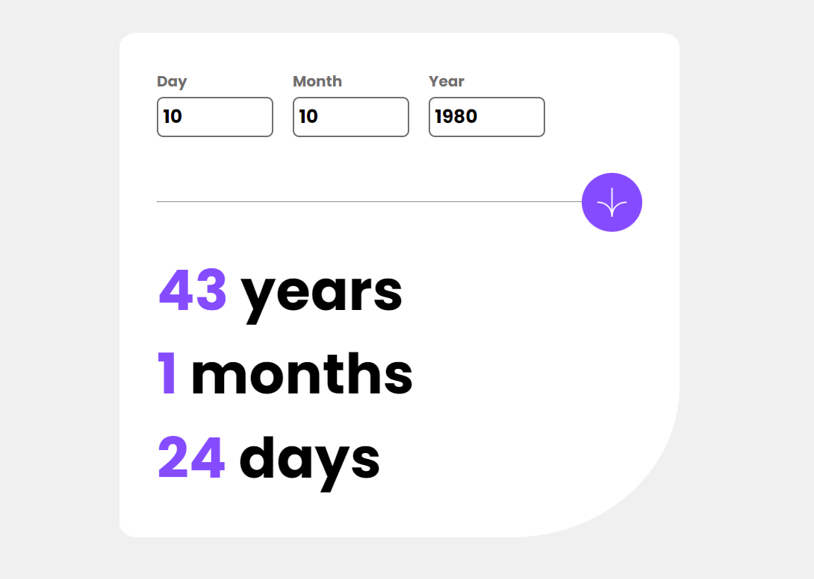

# Frontend Mentor - Age calculator app solution

This is my personal solution to the [Age calculator app challenge on Frontend Mentor](https://www.frontendmentor.io/challenges/age-calculator-app-dF9DFFpj-Q).

Frontend Mentor challenges help you improve your coding skills by giving you realistic projects to build, they provide you with a jpg of what the design or component should look like at each viewport width and then you write the code to make the design a functional website.

## Table of contents
- [The challenge](#the-challenge)
- [Screenshot](#screenshot)
- [Links](#links)
- [Built with](#built-with)
- [Author](#author)

### The challenge

To Create an Age Calculator component that takes in a users inputted age and returns their current age in the format of -- years -- months --days.

1. Create the UI using HTML And CSS using a mobile first approach.
2. Display the optimal layout for the interface depending on the users device's screen size
3. Retrive the current date using the JavaScript Date object.
4. Retrive / Access user inputs within JavaScript.
5. Validate the user input to ensure all input fields are valid.
6. If all inputs are valid progress to preforming the required calculations and output the result for the user to view.
7. When an inputs field has recieved input but that input is invalid, display the appropriate error message and color changes to the affected input.

Although initially calculating the output appeared quite simple there was definitley some tricky edge cases such as accounting for different months having a varying amounts of days as well as leap year occurances over ones lifetime up until the current date to ensure the calculation output is accurate.

### Screenshot
Below is a Gif that shows my age calculator being used.

### Links

- You can view my code repo for this project at: [https://github.com/jacksen30/age-calculator-app](https://github.com/jacksen30/age-calculator-app)
- Check out the Live Site at: [https://jn-age-calculator-app.netlify.app/](https://jn-age-calculator-app.netlify.app/)

### Built with

- Semantic HTML5 markup
- CSS
- Flexbox
- Mobile-first workflow
- JavaScript
- [Deployed with netlify](https://www.netlify.com/)
- [Veed to create Gif for README.md](https://www.veed.io/)

## Author

- I would love for you to visit my website [devbyjacksen.com](https://devbyjacksen.com/)
- You can find me on Frontend Mentor [@jacksen30](https://www.frontendmentor.io/profile/jacksen30)
